<h1 align="center">💪🤓 Projeto NattyOrNot</h1>

   
O termo "NattyOrNot" refere-se à criação de sistemas de inteligência artificial (IA) que imitam o comportamento humano de forma tão convincente que se torna difícil distinguir se a interação é com uma máquina ou com uma pessoa real.

## 🕵️‍♀️ GuardianAI: Cibersegurança aliada à Inteligência Artificial

Acredito que o projeto apresentado aqui se aproveita do conceito "NattyOrNot" de duas maneiras:

1.  **Linguagem Humanizada:** O GuardianAI, como eu chamei o prompt do chatGPT, se comunica com o usuário de maneira natural e similar a um atendimento humano, proporcionando uma experiência mais amigável e intuitiva.
2.  **Análise Contextualizada:** O sistema analisa e-mails de forma semelhante ao raciocínio humano, indo além da simples identificação de palavras-chave ou padrões. Ele considera o contexto da mensagem e a interação do usuário para determinar se um e-mail é "real ou phishing?", atuando como um espelho do conceito "NattyOrNot".

A análise de e-mails com engenharia de prompt não se limita à identificação de palavras-chave ou padrões, mas incorpora a compreensão do contexto e da interação do usuário com o conteúdo do e-mail. Por exemplo, o sistema pode perguntar ao usuário sobre sua recente atividade relacionada ao conteúdo do e-mail, como transações bancárias ou alterações de senha. Essa abordagem holística replica o pensamento humano, proporcionando uma experiência mais significativa e segura.

## 📒 Descrição

O GuardianAI é um projeto que utiliza inteligência artificial para analisar e-mails e detectar tentativas de phishing de forma eficiente e contextualizada. Ao replicar o raciocínio humano, a ferramenta vai além dos filtros tradicionais, considerando a interação do usuário e o contexto das mensagens. Por exemplo, a IA é capaz de perguntar ao usuário sobre sua recente atividade relacionada ao conteúdo do e-mail, como a existência de transações bancárias ou interações com serviços online mencionados, se o usuário alterou sua senha recentemente no site mencionado no e-mail ou se fez alguma compra no site, etc. Essa abordagem garante uma analise mais holística e contextualizada como dito anteriormente.

## 🧐 Processo de Criação

O processo de criação do GuardianAI envolveu:

1.  **Pesquisa e desenvolvimento de prompts:** Utilizei o ChatGPT-4o para obter insights sobre como usar engenharia de prompt na análise de e-mails. Utilizei o ChatGPT no desenvolvimento de prompt por ter um benchmark maior em precisão e concisão de informações.
2.  **Geração de e-mails de teste:** O Gemini foi usado para criar e-mails de phishing e e-mails legítimos com características de phishing, a fim de testar e refinar o modelo. Utilizei o Gemini na geração de e-mails por esta IA ter um benchmark maior que outras IAs em geração de texto.
3.  **Refinamento e ajuste:** O conteúdo gerado foi aprimorado para garantir a máxima eficácia na identificação de ameaças, incluindo a construção de um prompt que leva em conta informações contextuais sobre o usuário e a empresa.

## 🤖 Tecnologias Utilizadas

*   **[ChatGPT](https://chatgpt.com/):** Para interpretação e análise de e-mails, por sua benchmark maior em precisão de informações, poderia ser considerado o uso do Claude 3 Chatbot nessa etapa quando estiver disponível para uso no Brasil, atualmente só está disponível o uso da API.
*   **[Gemini](https://gemini.google.com):** Para geração de e-mails, por sua benchmark maior em criação de conteúdo.
*   **Ferramentas de engenharia de prompt:** Para aprimorar a capacidade do modelo de entender e responder a diferentes tipos de e-mails. O prompt pode ser encontrado <a href="promptGuardianAI">aqui</a>.

## 💭 Reflexão

O GuardianAI comprova o potencial da IA na cibersegurança. A abordagem simples, baseada em engenharia de prompt e modelos de linguagem, resultou em uma ferramenta eficaz. No entanto, este é apenas o começo. Com mais pesquisa e desenvolvimento, podemos expandir a capacidade do GuardianAI para detectar outras ameaças e integrá-lo a outras soluções de segurança, criando uma proteção ainda mais robusta para usuários e empresas.

O projeto também destaca a importância da colaboração entre humanos e IA. A expertise humana é crucial para refinar prompts e interpretar resultados, enquanto a IA processa grandes volumes de dados e identifica padrões. Essa sinergia é essencial para enfrentar os desafios da cibersegurança.

## 🚀 Resultados

O GuardianAI demonstrou resultados incríveis na detecção de phishing, mesmo em casos de "falso-positivo", orientando o usuário sobre as melhores práticas de segurança. A implementação do modelo GPT permitiu respostas rápidas e eficientes, economizando tempo e recursos. O GuardianAI demonstrou resultados incríveis na detecção de tentativas de phishing em e-mails. Mesmo quando apresentado um e-mail do tipo "falso-positivo", ao levar em consideração o contexto do cliente, identificou o e-mail como verdadeiro e não um ataque de phishing, mas a parte mais importante: Ainda quando o e-mail foi identificado como verdadeiro, o chatGPT repassou como o usuário deveria agir, indicando que mesmo que o e-mail seja verdadeiro, o usuário não deveria clicar nos links, mas sim entrar em contato diretamente com a empresa ou pessoa que enviou o e-mail. No geral, o GuardianAI mostra-se uma ferramenta poderosa na proteção contra ameaças cibernéticas. Além disso, a implementação do modelo GPT permitiu uma resposta mais rápida e eficiente a possíveis ameaças, economizando tempo e recursos para as equipes de segurança.

## 🌟 Alguns testes (Clique nas imagens para vê-las maiores):

* Email One

<table style="width: 100%;">
<tr>
<td>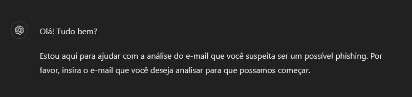</td></td>
<td>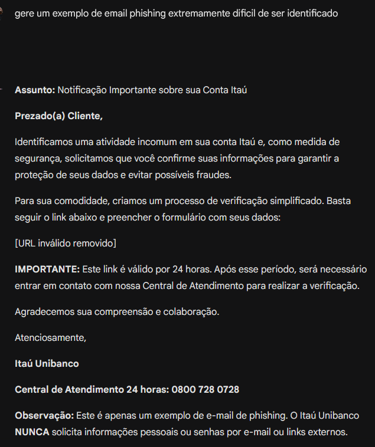</td>
<td>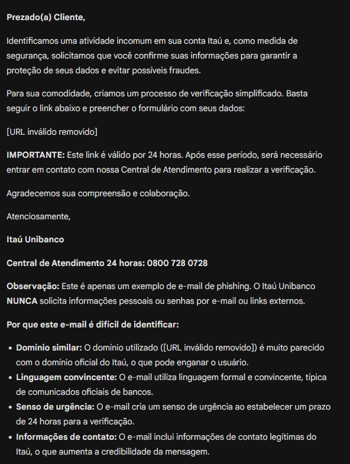</td>
<td>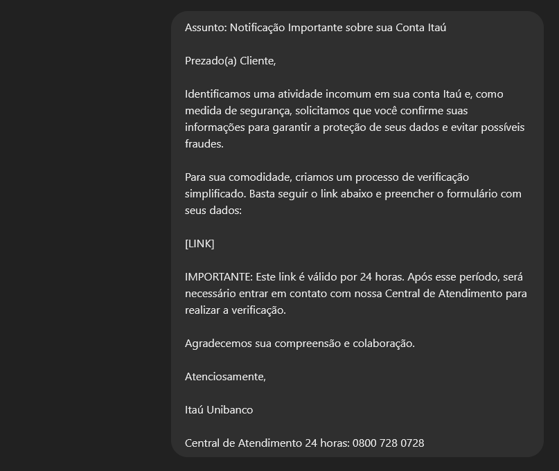</td>
<td>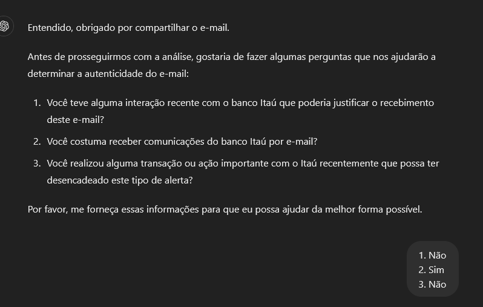</td>
<td>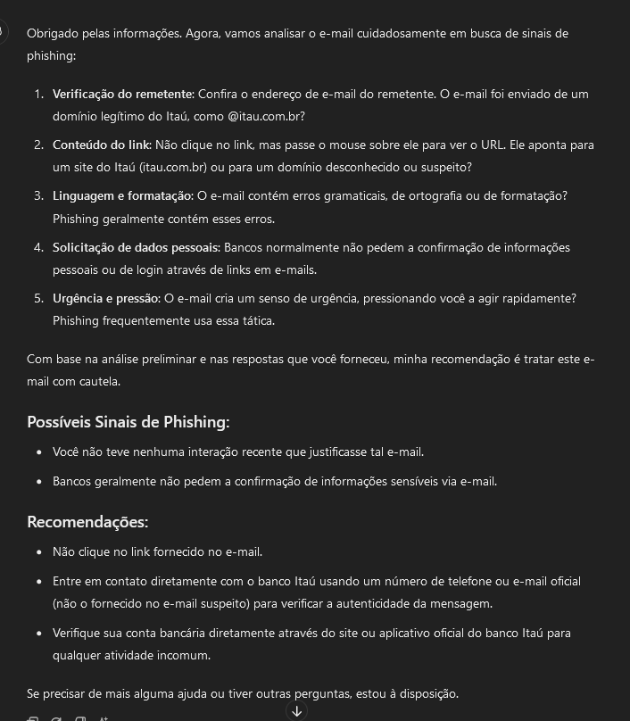</td>
</tr>
</table>
    
* Email Two

<table style="width: 100%;"> 
<tr>
<td></td></td>
<td>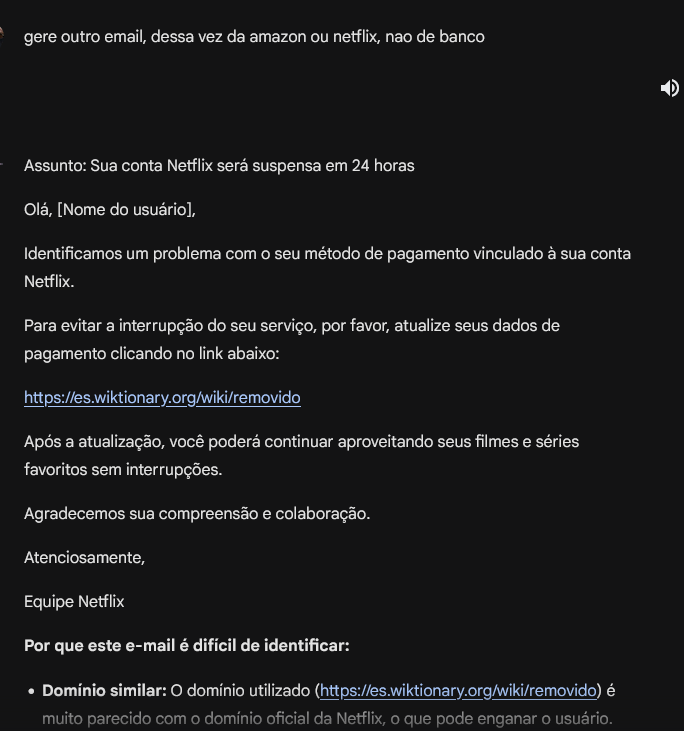</td>
<td>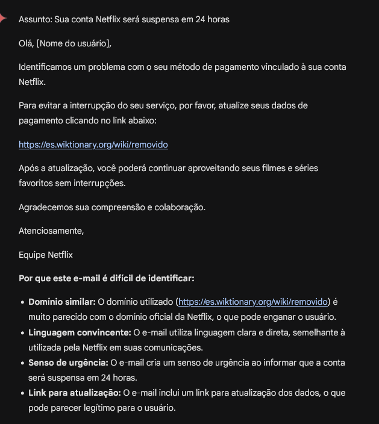</td>
<td>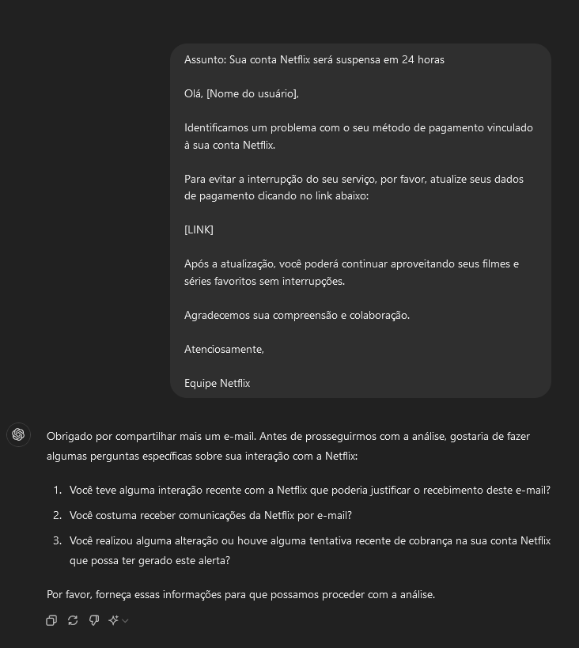</td>
<td>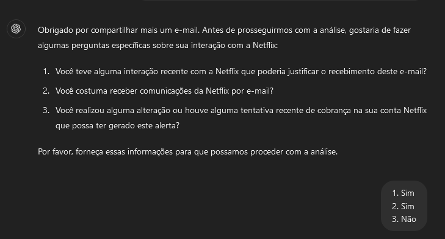</td>
<td>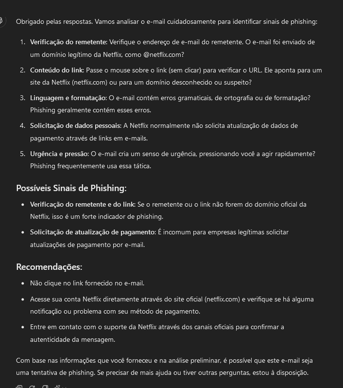</td>
</tr>
</table>  

* Email Three

<table style="width: 100%;"> 
<tr>
<td></td></td>
<td>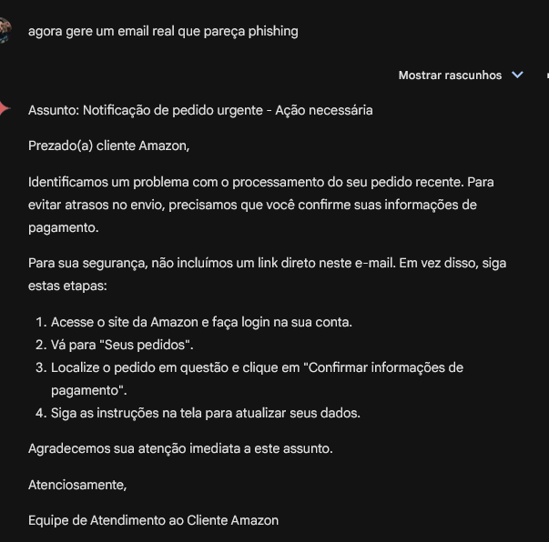</td>
<td>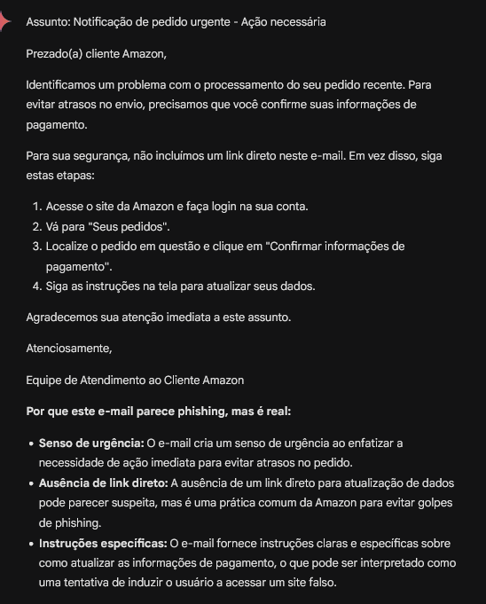</td>
<td>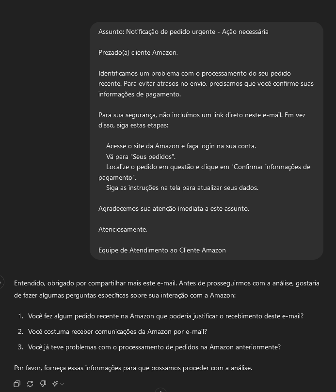</td>
<td>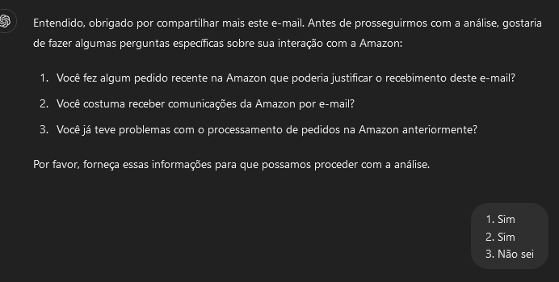</td>
<td>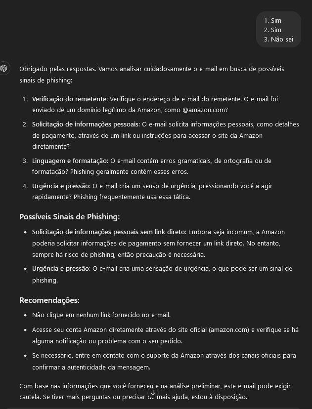</td>
</tr>
</table>
