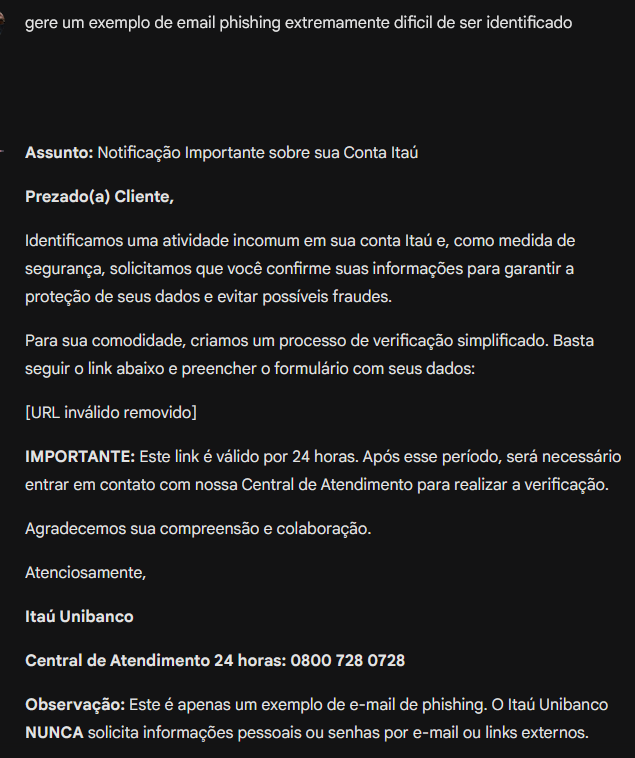
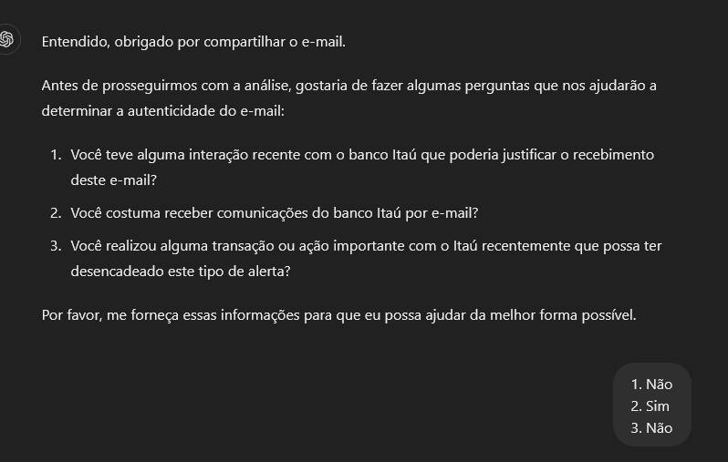
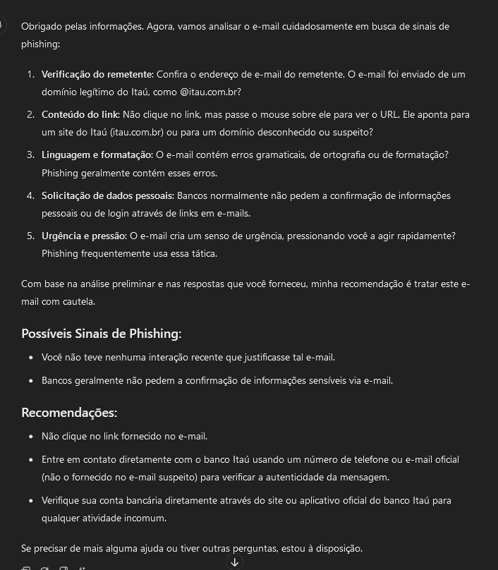
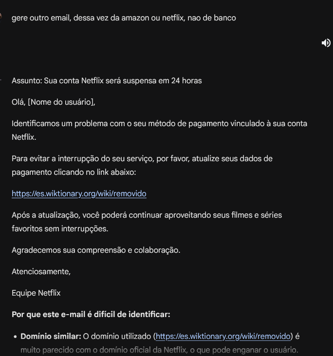
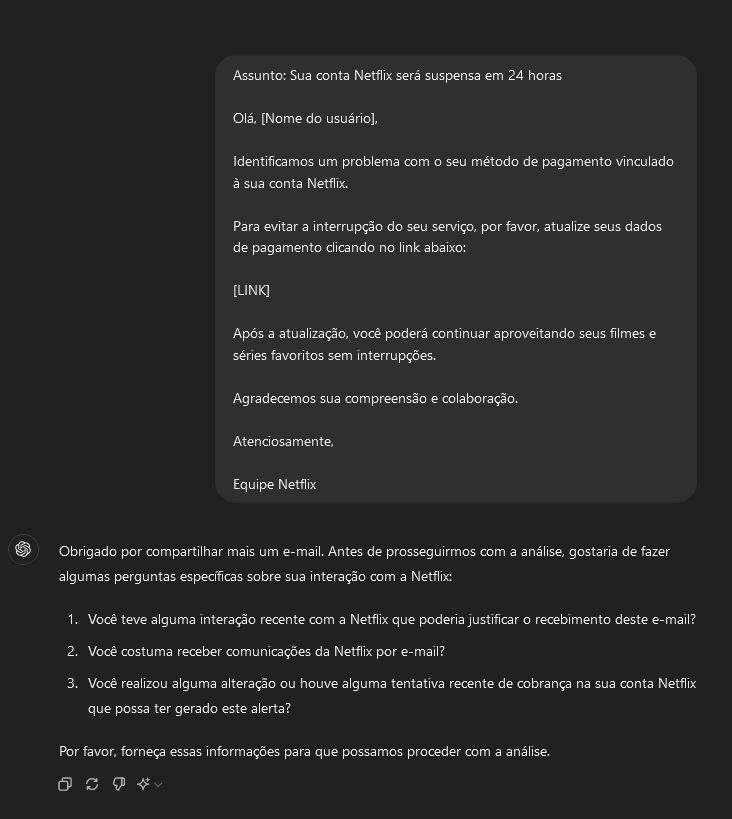
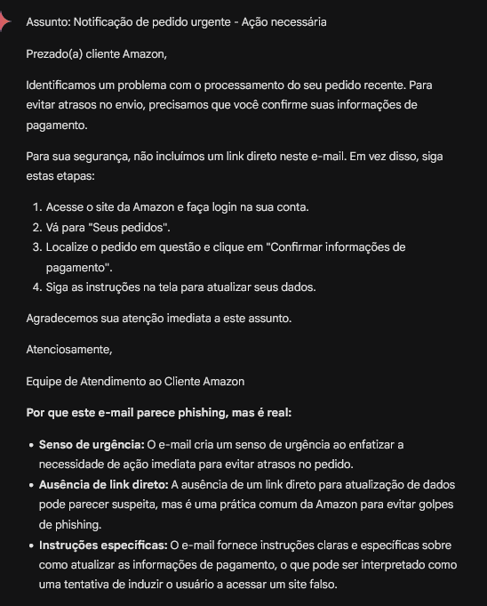

<h1 align="center">💪🤓 NattyOrNot Project</h1>

The term "NattyOrNot" refers to the creation of artificial intelligence (AI) systems that mimic human behavior so convincingly that it becomes difficult to distinguish whether the interaction is with a machine or a real person.

## 🕵️‍♀️ GuardianAI: Cybersecurity allied with Artificial Intelligence

I believe the project presented here takes advantage of the "NattyOrNot" concept in two ways:

1. **Humanized Language:** GuardianAI, as I called the chatGPT prompt, communicates with the user in a natural and similar way to human interaction, providing a more friendly and intuitive experience.
2. **Contextualized Analysis:** The system analyzes emails similar to human reasoning, going beyond simple identification of keywords or patterns. It considers the context of the message and the user interaction to determine if an email is "real or phishing?", acting as a mirror of the "NattyOrNot" concept.

The email analysis with prompt engineering is not limited to identifying keywords or patterns but incorporates understanding of the context and user interaction with the email content. For example, the system may ask the user about their recent activity related to the email content, such as bank transactions or interactions with mentioned online services, if the user recently changed their password on the mentioned website in the email, or if they made any purchases on the website, etc. This holistic approach replicates human thinking, providing a more meaningful and secure experience.

## 📒 Description

GuardianAI is a project that uses artificial intelligence to analyze emails and detect phishing attempts efficiently and contextually. By replicating human reasoning, the tool goes beyond traditional filters, considering user interaction and message context. For example, AI can ask the user about their recent activity related to the email content, such as bank transactions or interactions with mentioned online services, if the user recently changed their password on the mentioned website in the email, or if they made any purchases on the website, etc. This approach ensures a more holistic and contextualized analysis as mentioned earlier.

## 🧐 Creation Process

The creation process of GuardianAI involved:

1. **Research and development of prompts:** I used ChatGPT-4o to gain insights on using prompt engineering in email analysis. I used ChatGPT in prompt development due to its higher benchmark in accuracy and conciseness of information.
2. **Generation of test emails:** Gemini was used to create phishing emails and legitimate emails with phishing characteristics to test and refine the model. I used Gemini in email generation because this AI has a higher benchmark than other AIs in text generation.
3. **Refinement and adjustment:** The generated content was enhanced to ensure maximum effectiveness in threat identification, including the construction of a prompt that takes into account contextual information about the user and the company.

## 🤖 Technologies Used

* **[ChatGPT](https://chatgpt.com/):** For interpretation and analysis of emails, due to its higher benchmark in information accuracy. The use of Claude 3 Chatbot could be considered in this stage for the same reason.
* **[Gemini](https://gemini.google.com):** For email generation, due to its higher benchmark in content creation.
* **Prompt engineering tools:** To enhance the model's ability to understand and respond to different types of emails. The prompt used can be found <a href="promptGuardianAI">here</a>.

## 💭 Reflections

GuardianAI proves the potential of AI in cybersecurity. The simple approach, based on prompt engineering and language models, resulted in an effective tool. However, this is just the beginning. With further research and development, we can expand GuardianAI's ability to detect other threats and integrate it with other security solutions, creating even more robust protection for users and companies.

The project also highlights the importance of collaboration between humans and AI. Human expertise is crucial for refining prompts and interpreting results, while AI processes large volumes of data and identifies patterns. This synergy is essential to address the challenges of cybersecurity.

## 🚀 Results

GuardianAI has shown incredible results in phishing detection, even in cases of "false positives," it guides the user on best security practices. The implementation of the GPT model allowed for quick and efficient responses, saving time and resources. GuardianAI has demonstrated incredible results in detecting phishing attempts in emails. Even when presented with a "false positive" email, after considering the client's context, it identified the email as genuine and not a phishing attack. However, the most important part: Even when the email was identified as genuine, the chatGPT provided guidance on how the user should act, indicating that even if the email is genuine, the user should not click on the links but rather contact the company or person who sent the email directly. Overall, GuardianAI proves to be a powerful tool in protecting against cyber threats. Furthermore, the implementation of the GPT model allowed for a faster and more efficient response to potential

## 🌟 Tests (Click to see it bigger):

* Email One

<table style="width: 100%;">
<tr>
<td></td></td>
<td></td>
<td></td>
<td></td>
<td></td>
<td></td>
</tr>
</table>
    
* Email Two

<table style="width: 100%;"> 
<tr>
<td></td></td>
<td></td>
<td></td>
<td></td>
<td></td>
<td></td>
</tr>
</table>  

* Email Three

<table style="width: 100%;"> 
<tr>
<td></td></td>
<td></td>
<td></td>
<td></td>
<td></td>
<td></td>
</tr>
</table>
